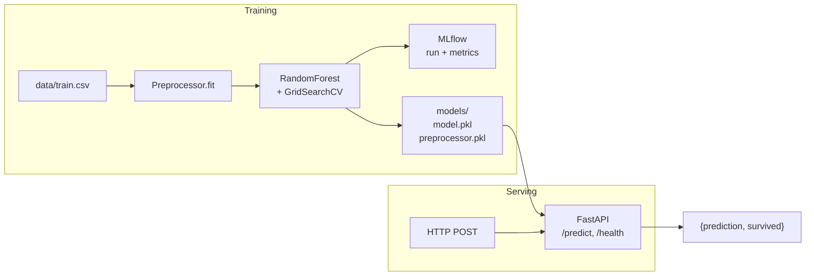

# end-to-end-ml-pipeline

A small, honest end-to-end ML service: train a Titanic survival classifier,
log the run with **MLflow**, ship a **FastAPI** inference service in **Docker**.
Preprocessing lives in a single stateful `Preprocessor` that is fit on the
training set and saved alongside the model — so inference on a single row
uses *training* statistics, not the row's own values.

> **Status:** portfolio project. Training + serving work end-to-end; CI runs
> lint + pytest and builds the Docker image on every push.

## Architecture



## Layout

```
src/
  preprocessing.py   # Preprocessor (fit/transform, save/load)
  data_loader.py     # Reads data/train.csv, data/test.csv
  train_model.py     # CLI: train with MLflow logging
  run_pipeline.py    # CLI: train + eval + score test → submission.csv
  evaluate_model.py  # CLI: evaluate a saved model on a stratified holdout
  predict_model.py   # CLI: batch-score an arbitrary CSV
  app.py             # FastAPI serving (Pydantic-validated inputs)
tests/
  test_preprocessing.py
  test_api.py
Dockerfile, docker-compose.yaml, Makefile, requirements*.txt
.github/workflows/ci.yml
```

## Quickstart

```bash
# 1. Install
make install-dev

# 2. Put Kaggle Titanic CSVs in data/
#    (train.csv, test.csv from https://www.kaggle.com/c/titanic)

# 3. Train
make train
#   - fits Preprocessor on train.csv
#   - grid-searches RandomForest, prints validation metrics
#   - writes models/random_forest_model.pkl + models/preprocessor.pkl
#   - writes predictions/submission.csv for the Kaggle test set

# 4. Serve
make serve
#   - uvicorn on http://localhost:8000  (FastAPI docs at /docs)

# 5. Try it
curl -X POST http://localhost:8000/predict \
  -H 'Content-Type: application/json' \
  -d '{"Pclass":3,"Sex":"male","Age":22,"SibSp":1,"Parch":0,"Fare":7.25,"Embarked":"S"}'
```

## Docker

```bash
make docker-build   # builds titanic-pipeline-api
make docker-up      # docker compose up -d, mounts ./models read-only

curl http://localhost:8000/health
```

## MLflow

`train_model.py` wraps training in an `mlflow.start_run()`; metrics, the
estimator, and the fitted `Preprocessor` are all logged as artifacts. Browse
with `mlflow ui` (reads `./mlruns`).

## Tests

```bash
make test
```

The suite covers:

- `Preprocessor` state, single-row inference, unseen categories, and
  save/load round-trip.
- The FastAPI `/predict`, `/predict/batch`, and `/health` endpoints,
  including Pydantic validation errors (422) and domain errors (400).

CI also builds the Docker image.

## Design notes

**Why a stateful `Preprocessor`?** The original version ran
`df['Age'].fillna(df['Age'].median())` *inside* the inference path — on a
single-row request that's the row's own value (or NaN). Now `fit()` captures
`age_median`, `fare_median`, `embarked_mode`, a fitted `LabelEncoder`, and a
`StandardScaler` on the training set, and `transform()` applies them. The
whole thing is one joblib artifact so serving can't drift from training.

**Why FastAPI over Flask?** Pydantic gives us typed input validation with
automatic 422s, and `/docs` is free. Start-up loads artifacts once in a
`lifespan` hook; nothing is re-read per request.

## Roadmap

What would make this a genuinely production-ready service:

- [ ] Kubernetes manifests (Deployment + Service + HPA) for the API.
- [ ] Drift monitoring (Evidently or WhyLogs) with a Prometheus metrics endpoint.
- [ ] MLflow Model Registry with staging → production promotion, served via `mlflow.pyfunc` instead of loading a pickle.
- [ ] DVC for data + model versioning.
- [ ] Hydra-based config instead of env vars + defaults.
- [ ] A PySpark ingestion stage (only if we actually scale past CSV — otherwise don't).

## License

MIT — see [LICENSE](LICENSE).
