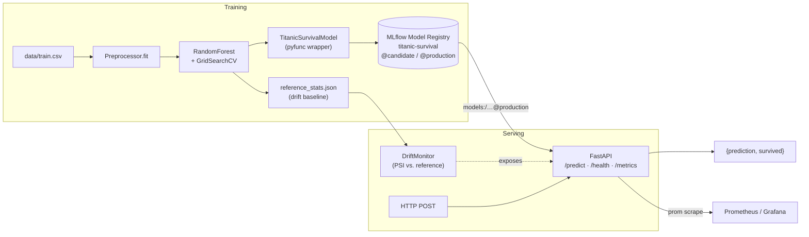

# end-to-end-ml-pipeline

A small, honest end-to-end ML service: train a Titanic survival classifier,
log the run with **MLflow**, ship a **FastAPI** inference service in **Docker**.
Preprocessing lives in a single stateful `Preprocessor` that is fit on the
training set and saved alongside the model — so inference on a single row
uses *training* statistics, not the row's own values.

> **Status:** portfolio project. Training + serving work end-to-end; CI runs
> lint + pytest and builds the Docker image on every push.

## Architecture



## Layout

```
src/
  preprocessing.py   # Preprocessor (fit/transform, save/load)
  data_loader.py     # Reads data/train.csv, data/test.csv
  mlflow_model.py    # Preprocessor + estimator as one MLflow pyfunc
  monitoring.py      # DriftMonitor, ReferenceStats, Prometheus metrics
  train_model.py     # CLI: train, log pyfunc, register, set alias
  run_pipeline.py    # CLI: train + eval + score test → submission.csv
  evaluate_model.py  # CLI: evaluate a saved model on a stratified holdout
  predict_model.py   # CLI: batch-score an arbitrary CSV
  app.py             # FastAPI serving (Registry URI or filesystem fallback)
tests/
  test_preprocessing.py
  test_api.py
  test_mlflow_model.py
  test_monitoring.py
Dockerfile, docker-compose.yaml, Makefile, requirements*.txt
.github/workflows/ci.yml
```

## Quickstart

```bash
# 1. Install
make install-dev

# 2. Put Kaggle Titanic CSVs in data/
#    (train.csv, test.csv from https://www.kaggle.com/c/titanic)
#    Don't have Kaggle? Generate stand-in data with the same schema:
python scripts/generate_synthetic_titanic.py

# 3. Train
make train
#   - fits Preprocessor on train.csv
#   - grid-searches RandomForest, prints validation metrics
#   - writes models/random_forest_model.pkl + models/preprocessor.pkl
#   - writes predictions/submission.csv for the Kaggle test set

# 4. Serve
make serve
#   - uvicorn on http://localhost:8000  (FastAPI docs at /docs)

# 5. Try it
curl -X POST http://localhost:8000/predict \
  -H 'Content-Type: application/json' \
  -d '{"Pclass":3,"Sex":"male","Age":22,"SibSp":1,"Parch":0,"Fare":7.25,"Embarked":"S"}'
```

## Docker

```bash
make docker-build   # builds titanic-pipeline-api
make docker-up      # docker compose up -d, mounts ./models read-only

curl http://localhost:8000/health
```

## MLflow Model Registry

`train_model.py` wraps training in `mlflow.start_run()`, logs a single
**pyfunc** artifact (Preprocessor + estimator wrapped as
`TitanicSurvivalModel`), and registers it under the name
`titanic-survival`. Every new version gets the `@candidate` alias; passing
`--promote` also moves the `@production` alias.

```bash
python src/train_model.py --model random_forest            # register as @candidate
python src/train_model.py --model random_forest --promote  # also promote to @production
mlflow ui  # browse runs + registry at http://localhost:5000
```

Serving reads whichever path is set:

```bash
# Registry path (production).
MODEL_URI=models:/titanic-survival@production make serve

# Filesystem path (local dev / CI / Dockerfile default).
make serve   # falls back to models/<model>_model.pkl + models/preprocessor.pkl
```

## Metrics & drift

`GET /metrics` returns Prometheus text with per-class prediction
counters, a prediction-latency histogram, and PSI-based feature drift
gauges computed from a rolling buffer of recent inputs against the
training distribution captured in `models/reference_stats.json`.

```
# HELP titanic_predictions_total Predictions served, labelled by output class.
# TYPE titanic_predictions_total counter
titanic_predictions_total{label="0"} 42.0
titanic_predictions_total{label="1"} 18.0

# HELP titanic_prediction_latency_seconds End-to-end latency of a /predict call (seconds).
# TYPE titanic_prediction_latency_seconds histogram
titanic_prediction_latency_seconds_bucket{le="0.01"} 57.0
titanic_prediction_latency_seconds_bucket{le="+Inf"} 60.0

# HELP titanic_feature_drift_psi PSI of recent inputs vs. the training distribution.
# TYPE titanic_feature_drift_psi gauge
titanic_feature_drift_psi{feature="Age"}  0.03
titanic_feature_drift_psi{feature="Fare"} 0.11
```

Scrape with Prometheus, graph with Grafana, alert when any
`feature_drift_psi` crosses `0.25` (the significant-drift threshold).

### Running the observability stack locally

```bash
make docker-up    # builds the API, brings up prometheus + grafana
make dashboards   # prints URLs
```

Prometheus scrapes the API's `/metrics` directly on a 15s interval
(no Pushgateway needed — the API is long-lived; contrast with the
batch ETL pipeline where Pushgateway is the right tool). Grafana
auto-loads a provisioned dashboard
([`observability/grafana/dashboards/titanic-api.json`](observability/grafana/dashboards/titanic-api.json))
with:

* **Requests/minute** and **positive rate** at a glance.
* **p50 / p95 / p99 latency** computed from `histogram_quantile` over
  the prediction-latency histogram — the three numbers you actually
  put in a serving SLO.
* **Max feature drift PSI** with green / yellow / red thresholds at
  0.0 / 0.1 / 0.25, plus a per-feature time series for drill-down.
* A table view of the loaded model's `model_info` (registry URI or
  filesystem path + the loaded version) so on-call can tell at a
  glance which model is actually in production right now.

**Screenshot — pending.** A `docs/grafana-dashboard.png` will land
via a GitHub Actions workflow that spins up the compose stack on an
Ubuntu runner, drives synthetic traffic, snapshots the dashboard with
Playwright, and commits it back. Running that capture locally depends
on having a container runtime; keeping it in CI makes it reproducible
and contributor-friendly.

## Tests

```bash
make test
```

The suite covers:

- `Preprocessor` state, single-row inference, unseen categories, and
  save/load round-trip.
- The FastAPI `/predict`, `/predict/batch`, `/health`, and `/metrics`
  endpoints, including Pydantic validation errors (422) and domain
  errors (400).
- The MLflow pyfunc round-trip: log, load via URI, assert predictions
  match the unwrapped estimator on raw input.
- `ReferenceStats.fit/save/load`, PSI on matched vs. shifted
  distributions, and the `DriftMonitor`'s Prometheus output.

CI also builds the Docker image.

## Design notes

**Why a stateful `Preprocessor`?** The original version ran
`df['Age'].fillna(df['Age'].median())` *inside* the inference path — on a
single-row request that's the row's own value (or NaN). Now `fit()` captures
`age_median`, `fare_median`, `embarked_mode`, a fitted `LabelEncoder`, and a
`StandardScaler` on the training set, and `transform()` applies them. The
whole thing is one joblib artifact so serving can't drift from training.

**Why a pyfunc + Model Registry, not two pickles on disk?** Loading a
`Preprocessor.pkl` and a `model.pkl` separately is two chances to get
the versioning wrong. When they drift, predictions get silently wrong,
not loudly broken. Wrapping both inside a single
`mlflow.pyfunc.PythonModel` and registering it under
`models:/titanic-survival@production` makes the serving unit atomic —
one URI, one version, one rollback button. The filesystem path still
exists as a fallback so CI and the Dockerfile-baked image keep working.

**Why aliases instead of Stages?** MLflow 2.9+ deprecated the
`Staging`/`Production` stage strings in favour of arbitrary aliases.
Aliases are cheaper to reason about (no hidden state machine), they
let you run e.g. `@candidate` + `@production` in parallel for
shadow-scoring, and they're what `models:/name@alias` URIs actually
resolve against.

**Why PSI rather than Evidently / WhyLogs?** Evidently is the right
choice when you want an HTML report with a dozen stats tests. For a
live `/metrics` endpoint powering a Grafana graph, the thing you
actually plot is a single scalar per feature — and PSI is the standard
for that. Rolling our own ~20 lines of `compute_psi` keeps the
dependency surface small and documents what "drift" means. On the
static Kaggle dataset, the numbers are ~0 by construction — the value
is the wiring: point this at a live stream and it earns its keep.

**Why FastAPI over Flask?** Pydantic gives us typed input validation
with automatic 422s, and `/docs` is free. Start-up loads artifacts
once in a `lifespan` hook; nothing is re-read per request.

## Roadmap

- [x] MLflow Model Registry with alias-based promotion, served via `mlflow.pyfunc`.
- [x] Drift monitoring (PSI) with a Prometheus `/metrics` endpoint.
- [x] Grafana dashboard JSON checked into `observability/grafana/dashboards/`, auto-provisioned by compose.
- [ ] GitHub Actions workflow: compose up → drive synthetic traffic → Playwright screenshot of the dashboard → commit `docs/grafana-dashboard.png`.
- [ ] Alert rules (`prometheus.rules.yml`) for latency SLO + drift threshold.
- [ ] Shadow scoring: serve `@production` in the hot path, send a copy to `@candidate`, log disagreement rate.
- [ ] Kubernetes manifests — *only* if actually deployed to a cluster; otherwise it's ceremony.
- [ ] DVC for data + model versioning.
- [ ] Hydra-based config instead of env vars + defaults.
- [ ] A PySpark ingestion stage (only if we actually scale past CSV — otherwise don't).

## License

MIT — see [LICENSE](LICENSE).
